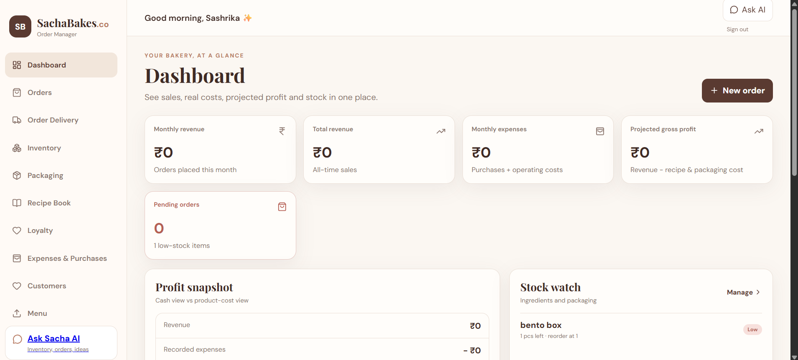
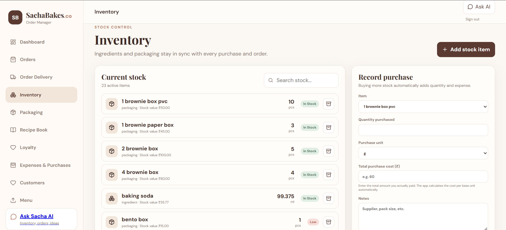
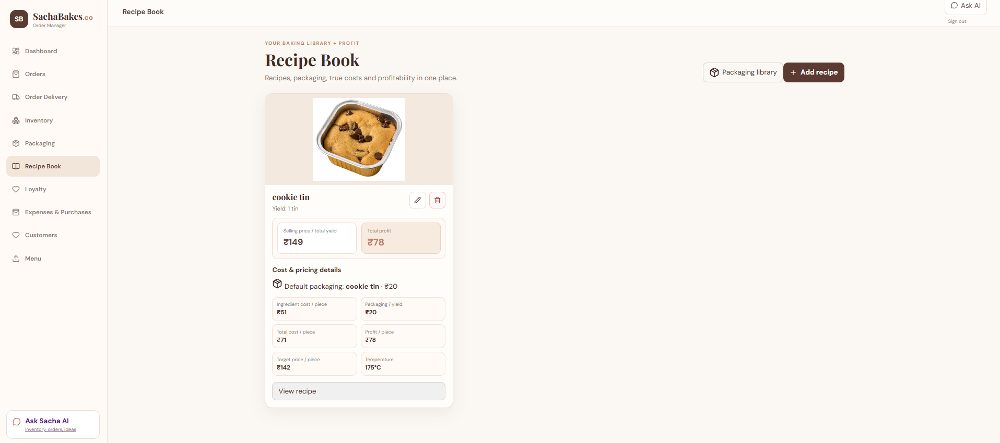
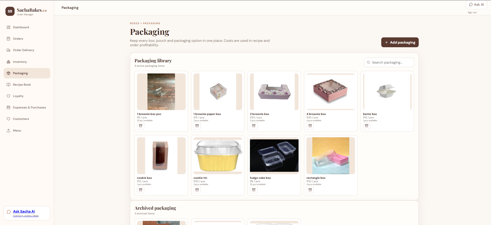
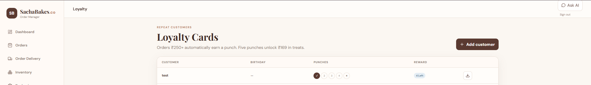
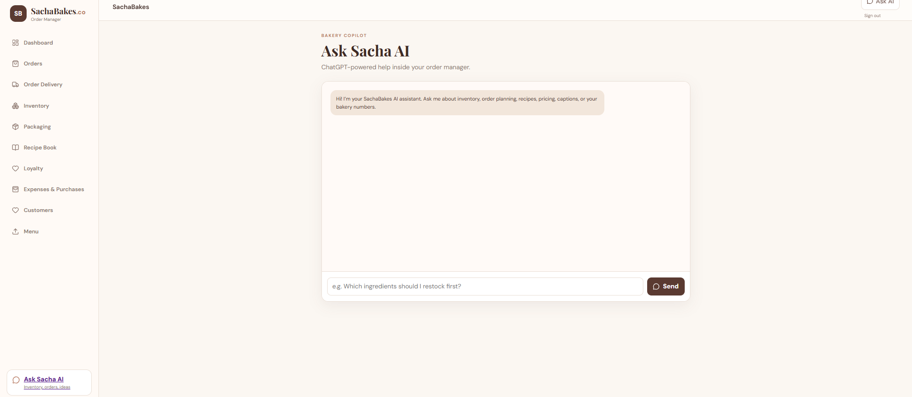

# Sacha Bakes — Order Management System

A full-stack order management and business operations platform built for **Sacha Bakes**, a small home bakery.

The system centralizes orders, inventory, recipes, packaging, expenses, customers, loyalty, and business analytics in one responsive application.

---

## 🚀 Project Overview

Sacha Bakes OMS was developed to simplify the day-to-day operations of a small bakery by replacing manual tracking with a centralized digital system.

The application helps manage:

- Customer orders
- Ingredient and packaging inventory
- Recipes and product costing
- Expenses and purchases
- Customer information
- Loyalty rewards
- Revenue and profit calculations
- Menu and price-card sharing
- AI-assisted business queries

---

## ✨ Key Features

### 📊 Dashboard
- Revenue tracking
- Expense tracking
- Estimated Cost of Goods Sold (COGS)
- Projected gross profit
- Cash profit
- Pending orders
- Low-stock alerts

### 🛒 Order Management
- Customer details
- Product selection
- Order pricing
- Dispatch dates
- Order status tracking
- Estimated cost and profit
- Automatic ingredient and packaging stock deduction
- Automatic loyalty punch for qualifying orders

### 📦 Inventory Management
- Ingredient inventory
- Packaging inventory
- Base-unit management
- Reorder levels
- Purchase tracking
- Automatic unit conversion such as kg → g and L → ml
- Purchase expenditure tracking

### 📖 Recipe Book
- Recipe images
- Recipe yield
- Ingredient quantities
- Preparation instructions
- Selling price
- Ingredient and packaging costs
- Cost per piece
- Profit per piece
- Target-margin price calculation

### 🎁 Packaging Library
- Store packaging items
- Upload packaging images
- Associate packaging with recipes
- Include packaging costs in product costing

### 👥 Customer Management
- Automatic customer creation and updates from orders
- Customer search
- Phone and address management
- Birthday information
- Repeat customer tracking
- One-tap WhatsApp communication

### 🎟️ Loyalty Program
- ₹250+ order punch logic
- Five-punch reward system
- Birthday tracking
- Reward redemption
- Digital loyalty cards
- Downloadable loyalty-card PDFs

### 💰 Expenses & Purchases
Track business spending such as:

- Marketing
- Delivery
- Equipment
- Other operating expenses
- Raw-material purchases

### 🧠 Ask Sacha AI
An OpenAI-powered business assistant that can work with live business context such as:

- Orders
- Inventory
- Recipes
- Costing
- Customer loyalty
- Business operations

The OpenAI API key is handled **server-side through the Express backend**.

### 📱 Responsive / PWA
- Responsive desktop and mobile interface
- PWA support
- Designed for installation on Android and iOS devices

---
## 📸 Screenshots

### Dashboard


### Inventory Management


### Recipe Book


### Packaging Library


### Loyalty Program


### Ask Sacha AI


## 🛠️ Tech Stack

| Category | Technologies |
|---|---|
| Frontend | React.js, Vite, JavaScript, CSS |
| Backend | Node.js, Express.js |
| Database | PostgreSQL / Supabase |
| Authentication | Supabase Auth |
| Storage | Supabase Storage |
| AI | OpenAI API |
| Deployment | Vercel / Netlify + backend hosting |
| PWA | Progressive Web App |

---

## 🧮 Business Calculations

The system calculates product profitability using:

**Total Cost**

`Ingredient Cost + Making Charges + Packaging Cost`

**Total Profit**

`Selling Price − Total Cost`

The application also calculates cost and pricing at the yield and per-piece levels.

---

## 🏗️ Application Modules

```text
Dashboard
│
├── Orders
├── Customers
├── Inventory
│   ├── Ingredients
│   └── Packaging
├── Recipe Book
├── Menu & Price Card
├── Loyalty
├── Expenses & Purchases
└── Ask Sacha AI